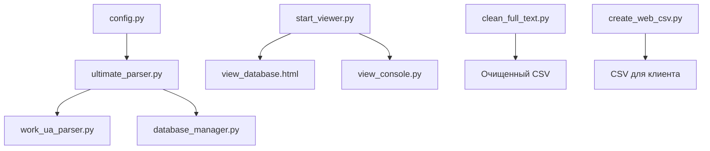

# Архитектура парсера Work.ua

## 1. Общая структура



## 2. Основные компоненты

### 2.1 Конфигурация (`config.py`)
- Настройки парсера и браузера
- Параметры пагинации
- Таймауты и задержки
- Селекторы элементов страницы
```python
PARSING_CONFIG = {
    "delay_between_pages": 2,
    "delay_between_cards": 1,
    "max_retries": 3,
    "max_pages": 1150,
    "max_cards_per_page": 14,
    "pagination_wait_timeout": 15,
    "pagination_retry_attempts": 3,
    "enable_pagination": True,
    "pagination_auto_adapt": True
}
```

### 2.2 Базовый парсер (`work_ua_parser.py`)
- Базовый класс с основными методами парсинга
- Управление WebDriver
- Обработка страниц и карточек
- Извлечение данных из HTML

Основные методы:
- `setup_driver()` - инициализация Selenium WebDriver
- `find_resume_cards()` - поиск карточек на странице
- `parse_resume_details()` - извлечение данных из резюме
- `handle_pagination()` - обработка пагинации

### 2.3 Продвинутый парсер (`ultimate_parser.py`)
- Наследует `WorkUaParser`
- Добавляет мультипоточность
- Реализует восстановление сессии
- Обрабатывает ошибки и повторы

Ключевые особенности:
- Мультипоточный парсинг (до 3 вкладок)
- Сохранение состояния сессии
- Обработка дубликатов
- Автоматическое восстановление
- Прогресс-бар и логирование

### 2.4 Управление данными (`database_manager.py`)
- Сохранение в JSON
- Проверка дубликатов
- Валидация данных
- Бэкапы и восстановление

### 2.5 Просмотр данных
#### Web интерфейс (`view_database.html`)
- Интерактивная таблица
- Фильтрация и поиск
- Детальный просмотр
- Статистика

#### Консольный интерфейс (`view_console.py`)
- Быстрый просмотр
- Базовая статистика
- Поиск по критериям

### 2.6 Очистка данных (`clean_full_text.py`)
- Удаление служебной информации
- Форматирование текста
- Извлечение структурированных данных
- Экспорт в CSV

## 3. Процессы

### 3.1 Процесс парсинга
1. Инициализация конфигурации
2. Запуск WebDriver
3. Открытие страницы поиска
4. Для каждой страницы:
   - Поиск карточек резюме
   - Открытие деталей в новых вкладках
   - Извлечение данных
   - Сохранение в JSON
   - Переход к следующей странице
5. Обработка ошибок и повторы
6. Сохранение состояния

### 3.2 Процесс восстановления
1. Загрузка последнего состояния
2. Проверка последней успешной страницы
3. Восстановление списка обработанных URL
4. Продолжение парсинга

### 3.3 Процесс очистки данных
1. Загрузка JSON файла
2. Применение регулярных выражений
3. Удаление служебной информации
4. Форматирование текста
5. Сохранение в CSV

## 4. Технические детали

### 4.1 Используемые технологии
- Python 3.8+
- Selenium WebDriver
- Chrome/Chromium
- HTML/JavaScript (веб-интерфейс)
- Pandas (обработка данных)
- Regular Expressions (очистка текста)

### 4.2 Зависимости
```
selenium>=4.0.0
webdriver-manager>=4.0.0
beautifulsoup4>=4.12.0
pandas>=1.5.0
```

### 4.3 Форматы данных
#### JSON структура
```json
{
    "name": "Имя кандидата",
    "title": "Должность",
    "salary": "Зарплата",
    "age_location": "Возраст, Город",
    "experience": ["Опыт работы 1", "Опыт работы 2"],
    "education_employment": "Образование",
    "full_text": "Полный текст резюме",
    "url": "URL резюме"
}
```

#### CSV структура
```csv
ID,Имя,Должность,Зарплата,Город,Возраст,Навыки,Количество_навыков,Опыт,Образование,URL,Подробно
```

## 5. Безопасность и производительность

### 5.1 Безопасность
- Защита от блокировки (задержки между запросами)
- Ротация User-Agent
- Обработка CAPTCHA
- Безопасное хранение данных

### 5.2 Производительность
- Мультипоточный парсинг
- Кэширование данных
- Оптимизация запросов
- Эффективное хранение

### 5.3 Надежность
- Автоматическое восстановление
- Обработка ошибок
- Логирование
- Бэкапы данных

## 6. Рекомендации по использованию

### 6.1 Оптимальные настройки
- До 3 параллельных потоков
- Задержка между страницами: 2-3 секунды
- Задержка между карточками: 1-2 секунды
- Размер пакета: 100-200 резюме

### 6.2 Мониторинг
- Отслеживание прогресса
- Проверка уникальности
- Контроль ошибок
- Анализ качества данных

### 6.3 Обслуживание
- Регулярные бэкапы
- Очистка кэша
- Обновление драйверов
- Проверка селекторов

## 7. Расширение функциональности

### 7.1 Возможные улучшения
- API интеграция
- Расширенная аналитика
- Экспорт в другие форматы
- Улучшенный UI

### 7.2 Известные ограничения
- Зависимость от структуры сайта
- Ограничения по скорости
- Требования к ресурсам
- Обработка динамического контента
